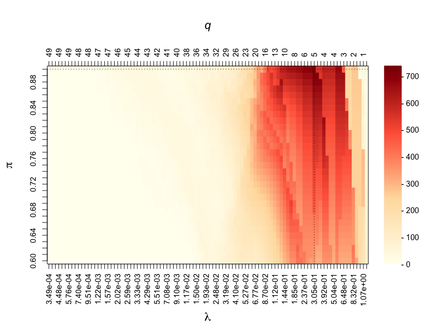
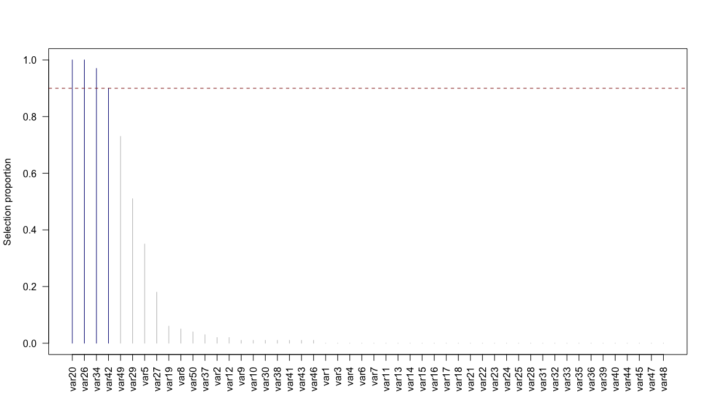
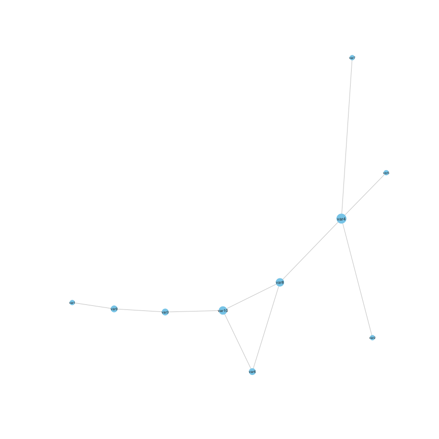
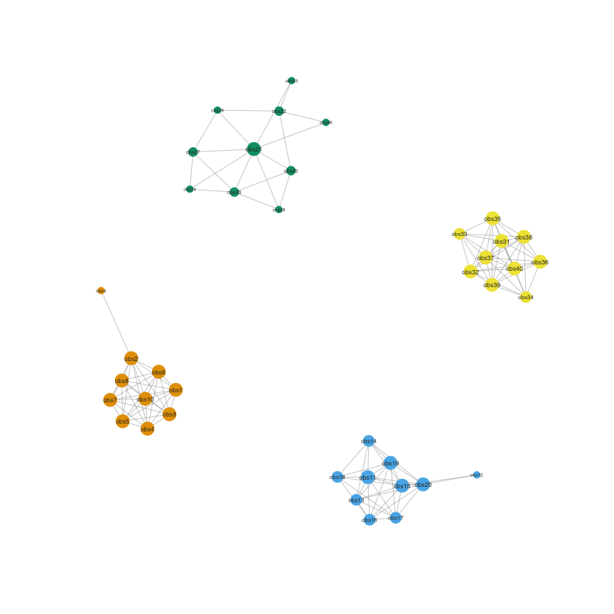
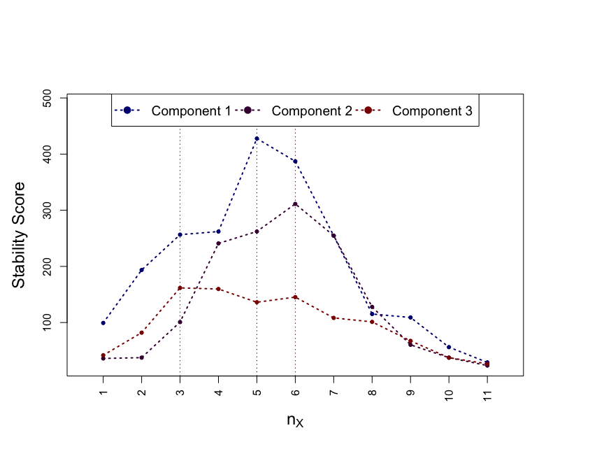
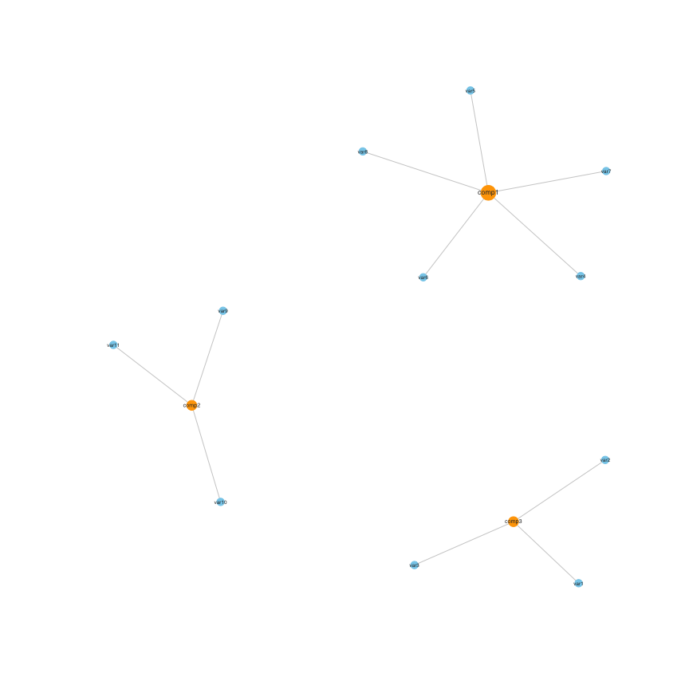

<!-- README.md is generated from README.Rmd. Please edit that file -->

# sharp: Stability-enHanced Approaches using Resampling Procedures

<!-- badges: start -->

[](https://CRAN.R-project.org/package=sharp)
[](https://r-pkg.org/pkg/sharp)

<!-- badges: end -->

## Description

> Implementation of stability selection for graphical modelling and
> variable selection in regression and dimensionality reduction. These
> models rely on resampling approaches to estimate selection
> probabilities. Calibration of the hyper-parameters is done via
> maximisation of a stability score measuring the likelihood of
> informative (non-uniform) selection procedure. This package also
> includes tools to simulate multivariate Normal data with different
> (partial) correlation structures.

## Installation

The released version of the package can be installed from
[CRAN](https://CRAN.R-project.org) with:

``` r
install.packages("sharp")
```

The development version can be installed from
[GitHub](https://github.com/):

``` r
devtools::install_github("barbarabodinier/fake") # required dependency
devtools::install_github("barbarabodinier/sharp")
```

## Variable selection

### Data simulation

We simulate data with

predictors and one outcome obtained from a linear combination of a
subset of the predictors and a normally distributed error term:

``` r
library(sharp)
#> Loading required package: fake

# Data simulation
set.seed(1)
simul <- SimulateRegression(n = 100, pk = 50)

# Predictors
X <- simul$xdata
dim(X)
#> [1] 100  50

# Continuous outcome
Y <- simul$ydata
dim(Y)
#> [1] 100   1
```

The output includes a binary matrix encoding if the variable was used in
the outcome definition:

``` r
head(simul$theta)
#>      outcome1
#> var1        0
#> var2        0
#> var3        0
#> var4        0
#> var5        1
#> var6        0
```

### Stability selection

Stability selection in a regression framework is implemented in the
function `VariableSelection()`. The predictor and outcome datasets are
provided as input:

``` r
stab <- VariableSelection(xdata = X, ydata = Y)
```

``` r
print(stab)
#> Stability selection using function PenalisedRegression with gaussian family.
#> The model was run using 100 subsamples of 50% of the observations.
```

Stability selection models with different pairs of parameters λ
(controlling the sparsity of the underlying algorithm) and π (threshold
in selection proportions) are calculated. By default, stability
selection is run in applied to LASSO regression, as implemented in
`glmnet`. The grids of parameter values used in the run can be extracted
using:

``` r
# First few penalty parameters
head(stab$Lambda)
#>         [,1]
#> s0 1.3748144
#> s1 1.2645070
#> s2 1.1630501
#> s3 1.0697335
#> s4 0.9839041
#> s5 0.9049612

# Grid of thresholds in selection proportion
stab$params$pi_list
#>  [1] 0.60 0.61 0.62 0.63 0.64 0.65 0.66 0.67 0.68 0.69 0.70 0.71 0.72 0.73 0.74
#> [16] 0.75 0.76 0.77 0.78 0.79 0.80 0.81 0.82 0.83 0.84 0.85 0.86 0.87 0.88 0.89
#> [31] 0.90

# Number of model pairs (i.e. number of visited stability selection models)
nrow(stab$Lambda) * length(stab$params$pi_list)
#> [1] 3100
```

### Calibration

The two hyper-parameters are jointly calibrated by maximising the
stability score, measuring how unlikely it is that features are
uniformly selected:

``` r
par(mar = c(7, 5, 7, 6))
CalibrationPlot(stab)
```



Visited penalty parameters λ are represented on the x-axis. The
corresponding average number of selected features by the underlying
algorithm (here, LASSO regression) are reported on the z-axis and
denoted by q. The different thresholds in selection proportions π are
represented on the y-axis. The stability score obtained for different
pairs of parameters (λ, π) are colour-coded.

The calibrated parameters and number of stably selected variables can be
quickly obtained with:

``` r
summary(stab)
#> Calibrated parameters: lambda = 0.305 and pi = 0.900
#> 
#> Maximum stability score: 736.982
#> 
#> Number of selected variable(s): 4
```

### Outputs

The stable selection status from the calibrated model can be obtained
from:

``` r
SelectedVariables(stab)
#>  var1  var2  var3  var4  var5  var6  var7  var8  var9 var10 var11 var12 var13 
#>     0     0     0     0     0     0     0     0     0     0     0     0     0 
#> var14 var15 var16 var17 var18 var19 var20 var21 var22 var23 var24 var25 var26 
#>     0     0     0     0     0     0     1     0     0     0     0     0     1 
#> var27 var28 var29 var30 var31 var32 var33 var34 var35 var36 var37 var38 var39 
#>     0     0     1     0     0     0     0     0     0     0     0     0     0 
#> var40 var41 var42 var43 var44 var45 var46 var47 var48 var49 var50 
#>     0     0     0     0     0     0     0     0     0     1     0
```

Stably selected variables are the ones with selection proportions above
the calibrated threshold π:

``` r
plot(stab)
```



Selection proportion values can be extracted using:

``` r
SelectionProportions(stab)
#>  var1  var2  var3  var4  var5  var6  var7  var8  var9 var10 var11 var12 var13 
#>  0.00  0.00  0.00  0.00  0.43  0.00  0.01  0.00  0.00  0.02  0.00  0.00  0.00 
#> var14 var15 var16 var17 var18 var19 var20 var21 var22 var23 var24 var25 var26 
#>  0.00  0.03  0.00  0.01  0.00  0.00  0.98  0.00  0.00  0.01  0.00  0.00  1.00 
#> var27 var28 var29 var30 var31 var32 var33 var34 var35 var36 var37 var38 var39 
#>  0.00  0.00  0.90  0.00  0.00  0.00  0.00  0.33  0.07  0.01  0.00  0.00  0.00 
#> var40 var41 var42 var43 var44 var45 var46 var47 var48 var49 var50 
#>  0.00  0.00  0.33  0.01  0.00  0.00  0.00  0.00  0.00  0.99  0.00
```

## Graphical modelling

### Data simulation

In Gaussian Graphical Modelling, the conditional independence structure
between nodes is encoded in nonzero entries of the partial correlation
matrix. We simulate data with

nodes that are connected in a scale-free network, where few nodes have a
lot of edges and most nodes have a small number of edges.

``` r
# Data simulation
set.seed(1)
simul <- SimulateGraphical(n = 100, pk = 10, topology = "scale-free")

# Nodes are the variables (columns)
X <- simul$data
dim(X)
#> [1] 100  10
```

The adjacency matrix of the simulated graph is included in the output:

``` r
simul$theta
#>       var1 var2 var3 var4 var5 var6 var7 var8 var9 var10
#> var1     0    0    0    0    0    0    0    0    1     0
#> var2     0    0    0    1    0    0    0    0    0     0
#> var3     0    0    0    0    0    0    0    0    1     1
#> var4     0    1    0    0    1    0    1    1    0     0
#> var5     0    0    0    1    0    0    0    0    0     0
#> var6     0    0    0    0    0    0    0    0    0     1
#> var7     0    0    0    1    0    0    0    0    0     0
#> var8     0    0    0    1    0    0    0    0    0     1
#> var9     1    0    1    0    0    0    0    0    0     0
#> var10    0    0    1    0    0    1    0    1    0     0
#> attr(,"class")
#> [1] "matrix"           "adjacency_matrix"
```

### Stability selection

Stability selection for graphical modelling is implemented in
`GraphicalModel()`. For sparser estimates, the model can be estimated
under the constraint that the upper-bound of the expected number of
falsely selected edges (PFER) is below a user-defined threshold:

``` r
stab <- GraphicalModel(xdata = X, PFER_thr = 10)
```

``` r
print(stab)
#> Stability selection using function PenalisedGraphical.
#> The model was run using 100 subsamples of 50% of the observations.
```

### Calibration

As in variable selection, parameters are jointly calibrated by
maximising the stability score:

``` r
par(mar = c(7, 5, 7, 6))
CalibrationPlot(stab)
```


The effect of the constraint on the PFER can be visualised in this
calibration plot. The white area corresponds to “forbidden” models,
where the upper-bound of the expected number of parameters would exceed
the value specified in PFER_thr.

Calibrated parameters and number of edges in the calibrated model can be
viewed using:

``` r
summary(stab)
#> Calibrated parameters: lambda = 0.331 and pi = 0.900
#> 
#> Maximum stability score: 1141.949
#> 
#> Number of selected edge(s): 10
```

### Outputs

The calibrated graph can be visualised using:

``` r
set.seed(1)
plot(stab)
```



The adjacency matrix of the calibrated stability selection graphical
model can be extracted using:

``` r
Adjacency(stab)
#>       var1 var2 var3 var4 var5 var6 var7 var8 var9 var10
#> var1     0    0    0    0    0    0    0    0    1     0
#> var2     0    0    0    1    0    0    0    0    0     0
#> var3     0    0    0    0    0    0    0    0    1     1
#> var4     0    1    0    0    1    0    1    1    0     0
#> var5     0    0    0    1    0    0    0    0    0     0
#> var6     0    0    0    0    0    0    0    1    0     1
#> var7     0    0    0    1    0    0    0    0    0     0
#> var8     0    0    0    1    0    1    0    0    0     1
#> var9     1    0    1    0    0    0    0    0    0     0
#> var10    0    0    1    0    0    1    0    1    0     0
```

And converted to an igraph object using:

``` r
mygraph <- Graph(Adjacency(stab))
set.seed(1)
plot(mygraph)
```



## Dimensionality reduction

### Data simulation

We simulate data with

variables related to

latent variables:

``` r
# Data simulation
set.seed(1)
simul <- SimulateComponents(n = 100, pk = c(3, 5, 4), v_within = c(0.8, 1), v_sign = -1)
#> The smallest proportion of explained variance by PC1 that can be obtained is 0.24.

# Simulated data
X <- simul$data

# Pearson's correlations
plot(simul)
```


``` r
# Relationships between variables and latent variables
simul$theta
#>       comp1 comp2 comp3 comp4 comp5 comp6 comp7 comp8 comp9 comp10 comp11
#> var1      0     0     1     1     1     0     0     0     0      0      0
#> var2      0     0     1     1     1     0     0     0     0      0      0
#> var3      0     0     1     1     1     0     0     0     0      0      0
#> var4      1     0     0     0     0     0     0     0     1      1      1
#> var5      1     0     0     0     0     0     0     0     1      1      1
#> var6      1     0     0     0     0     0     0     0     1      1      1
#> var7      1     0     0     0     0     0     0     0     1      1      1
#> var8      1     0     0     0     0     0     0     0     1      1      1
#> var9      0     1     0     0     0     1     1     1     0      0      0
#> var10     0     1     0     0     0     1     1     1     0      0      0
#> var11     0     1     0     0     0     1     1     1     0      0      0
#> var12     0     1     0     0     0     1     1     1     0      0      0
#>       comp12
#> var1       0
#> var2       0
#> var3       0
#> var4       1
#> var5       1
#> var6       1
#> var7       1
#> var8       1
#> var9       0
#> var10      0
#> var11      0
#> var12      0
```

### Stability selection

Stability selection for dimensionality reduction is implemented in
`BiSelection()`. It can be used in combination with sparse Principal
Component Analysis (sPCA) to recover the sparse set of variables
contributing to the Principal Components (PCs). Stability selection can
be applied on the first three PCs using:

``` r
stab <- BiSelection(xdata = X, implementation = SparsePCA, ncomp = 3)
#> Component 1
#> Loading required namespace: elasticnet
#> Component 2
#> Component 3
```

``` r
print(stab)
#> Stability selection using function SparsePCA with gaussian family.
#> The model was run using 100 subsamples of 50% of the observations.
```

### Calibration

As for models presented in previous sections, the hyper-parameters are
calibrated by maximising the stability score.

``` r
par(mar = c(7, 5, 7, 6))
CalibrationPlot(stab)
```



The PC-specific calibrated parameters are reported in:

``` r
stab$summary
#>   comp nx  pix        S
#> 1    1  5 0.90 454.4235
#> 2    2  7 0.84 264.5631
#> 3    3  4 0.87 256.4247
```

### Outputs

The sets of stably selected variables for each of the PCs are encoded
in:

``` r
SelectedVariables(stab)
#>       comp1 comp2 comp3
#> var1      0     1     1
#> var2      0     1     1
#> var3      0     0     1
#> var4      1     0     0
#> var5      1     0     0
#> var6      1     0     0
#> var7      1     0     0
#> var8      1     0     0
#> var9      0     1     0
#> var10     0     1     0
#> var11     0     1     0
#> var12     0     1     0
```

This can be visualised in a network:

``` r
set.seed(1)
plot(stab)
```



Corresponding selection proportions for each of the three PCs can be
obtained from:

``` r
SelectionProportions(stab)
#>       comp1 comp2 comp3
#> var1   0.07  0.84  0.87
#> var2   0.04  0.85  0.89
#> var3   0.00  0.77  0.89
#> var4   0.94  0.09  0.08
#> var5   0.94  0.11  0.00
#> var6   0.93  0.14  0.02
#> var7   0.93  0.16  0.04
#> var8   0.91  0.31  0.10
#> var9   0.06  0.93  0.45
#> var10  0.05  0.93  0.17
#> var11  0.07  0.93  0.20
#> var12  0.06  0.94  0.29
```
