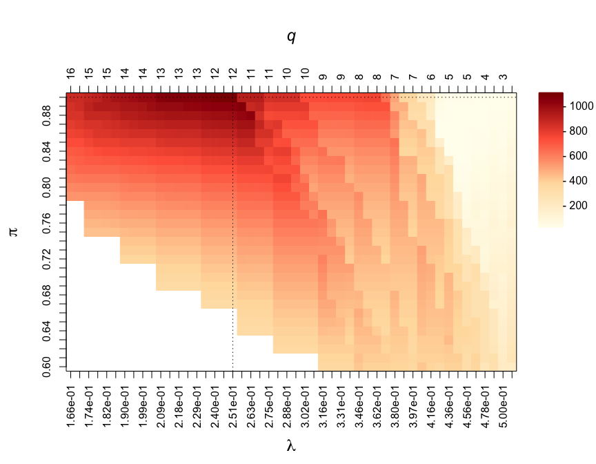

<!-- README.md is generated from README.Rmd. Please edit that file -->

# focus: Feature selectiOn and Clustering Using Stability

<!-- badges: start -->

<!-- badges: end -->

Implementation of stability-enhanced models for variable selection in
regression, graphical modelling and clustering. These methods are based
on resampling approaches to compute selection proportions. Calibration
of the models is done via maximisation of a stability score measuring
how unlikely it is that the selection procedure is uniform.

## Installation

<!-- You can install the released version of focus from [CRAN](https://CRAN.R-project.org) with: -->

<!-- ``` r -->

<!-- install.packages("focus") -->

<!-- ``` -->

The development version can be installed from
[GitHub](https://github.com/) with:

``` r
# install.packages("devtools")
devtools::install_github("barbarabodinier/focus")
```

## Variable selection

### Data simulation

A dataset with n=100 observations for p=50 potential predictors and a
continuous outcome is simulated:

``` r
library(focus)

# Data simulation
set.seed(1)
simul=SimulateRegression(n=100, pk=50)

# Potential predictors
X=simul$X 
print(dim(X))
#> [1] 100  50

# Continuous outcome
Y=simul$Y 
print(dim(Y))
#> [1] 100   1
```

### Stability selection

Stability selection in a regression framework is implemented in the
function `VariableSelection()`. The predictor and outcome datasets are
provided as input:

``` r
stab=VariableSelection(xdata=X, ydata=Y)
```

Stability selection models are run for multiple pairs of parameters λ
(controlling the sparsity of the underlying algorithm) and π (threshold
in selection proportions). By default, stability selection is run in
applied to LASSO regression, as implemented in `glmnet`. The grids of
parameter values used in the run can be extracted using:

``` r
# First few penalty parameters
print(head(stab$Lambda)) 
#>         [,1]
#> s0 1.3893601
#> s1 1.2875289
#> s2 1.1931612
#> s3 1.1057101
#> s4 1.0246686
#> s5 0.9495669

# Grid of thresholds in selection proportion
print(stab$params$pi_list)
#>  [1] 0.60 0.61 0.62 0.63 0.64 0.65 0.66 0.67 0.68 0.69 0.70 0.71 0.72 0.73 0.74
#> [16] 0.75 0.76 0.77 0.78 0.79 0.80 0.81 0.82 0.83 0.84 0.85 0.86 0.87 0.88 0.89
#> [31] 0.90

# Number of model pairs (i.e. number of visited stability selection models)
print(nrow(stab$Lambda)*length(stab$params$pi_list))
#> [1] 3100
```

### Calibration

The two parameters are jointly calibrated by maximising the stability
score, measuring how unlikely it is that features are uniformly
selected:

``` r
CalibrationPlot(stab)
```


Visited penalty parameters λ are represented on the x-axis. The
corresponding average number of selected features by the underlying
algorithm (here, LASSO models) are reported on the z-axis and denoted by
q. The different thresholds in selection proportions π are represented
on the y-axis. The stability score obtained for different pairs of
parameters (λ, π) are colour-coded and ranging from 0 to 1,200 on this
example.

### Outputs

The calibrated set of stably selected variables is obtained from:

``` r
stably_selected=SelectedVariables(stab)
print(stably_selected)
#>  var1  var2  var3  var4  var5  var6  var7  var8  var9 var10 var11 var12 var13 
#>     0     0     0     0     0     0     1     1     1     0     0     0     0 
#> var14 var15 var16 var17 var18 var19 var20 var21 var22 var23 var24 var25 var26 
#>     0     0     0     0     0     0     0     0     0     0     0     0     0 
#> var27 var28 var29 var30 var31 var32 var33 var34 var35 var36 var37 var38 var39 
#>     0     0     1     0     0     1     0     1     0     0     0     0     0 
#> var40 var41 var42 var43 var44 var45 var46 var47 var48 var49 var50 
#>     1     0     0     1     1     1     0     0     0     0     1
print(table(stably_selected))
#> stably_selected
#>  0  1 
#> 39 11
```

In this example, 11 variables are stably selected.

Additionally, selection proportions of the calibrated model can be
extracted:

``` r
selprop=SelectionProportions(stab)
print(selprop)
#>  var1  var2  var3  var4  var5  var6  var7  var8  var9 var10 var11 var12 var13 
#>  0.07  0.10  0.35  0.06  0.08  0.08  0.91  0.99  1.00  0.17  0.05  0.15  0.70 
#> var14 var15 var16 var17 var18 var19 var20 var21 var22 var23 var24 var25 var26 
#>  0.14  0.56  0.09  0.09  0.23  0.05  0.11  0.05  0.10  0.04  0.02  0.10  0.01 
#> var27 var28 var29 var30 var31 var32 var33 var34 var35 var36 var37 var38 var39 
#>  0.07  0.16  0.96  0.14  0.11  0.91  0.07  0.99  0.29  0.18  0.04  0.05  0.11 
#> var40 var41 var42 var43 var44 var45 var46 var47 var48 var49 var50 
#>  0.99  0.05  0.74  0.99  1.00  0.95  0.11  0.20  0.09  0.03  0.95
```

Selection proportions can be used to rank the variables by relevance in
association with the outcome:

``` r
selprop_ranked=sort(selprop, decreasing=TRUE)
plot(selprop_ranked, type="h", lwd=3, las=1, cex.lab=1.3, bty="n", ylim=c(0,1),
     col=ifelse(selprop_ranked>=Argmax(stab)[2],yes="red",no="grey"),
     xaxt="n", xlab="", ylab="Selection proportions")
abline(h=Argmax(stab)[2], lty=2, col="darkred")
axis(side=1, at=1:length(selprop_ranked), labels=names(selprop_ranked), las=2)
```


## Graphical modelling

### Data simulation

A dataset with n=100 observations of p=20 nodes with an underlying graph
structure is simulated:

``` r
# Data simulation
set.seed(1)
simul=SimulateGraphical(n=100, pk=20, topology="scale-free")

# Variables are nodes
X=simul$data
print(dim(X))
#> [1] 100  20
```

### Stability selection

Stability selection for graphical modelling is implemented in
`GraphicalModel()`. It takes the data as input:

``` r
stab=GraphicalModel(xdata=X)
```

### Calibration

As for variable selection, the stability selection graphical model is
controlled by two parameters controlling the sparsity of the underlying
algorithm and threshold in selection proportion. These parameters are
jointly calibrated by maximising the stability score:

``` r
CalibrationPlot(stab)
```



### Outputs

The adjacency matrix of the calibrated stability selection graphical
model is obtained with:

``` r
myadjacency=Adjacency(stab)
print(myadjacency)
#>       var1 var2 var3 var4 var5 var6 var7 var8 var9 var10 var11 var12 var13
#> var1     0    0    1    0    0    0    0    0    0     0     0     0     1
#> var2     0    0    0    0    0    0    0    0    0     0     0     1     0
#> var3     1    0    0    1    0    1    0    0    0     1     0     1     1
#> var4     0    0    1    0    0    0    0    0    0     0     0     0     0
#> var5     0    0    0    0    0    0    1    1    0     0     1     0     0
#> var6     0    0    1    0    0    0    0    0    0     1     0     0     0
#> var7     0    0    0    0    1    0    0    0    0     0     0     0     0
#> var8     0    0    0    0    1    0    0    0    0     0     0     0     0
#> var9     0    0    0    0    0    0    0    0    0     0     0     0     0
#> var10    0    0    1    0    0    1    0    0    0     0     0     0     0
#> var11    0    0    0    0    1    0    0    0    0     0     0     0     0
#> var12    0    1    1    0    0    0    0    0    0     0     0     0     0
#> var13    1    0    1    0    0    0    0    0    0     0     0     0     0
#> var14    0    0    1    0    1    0    0    1    0     0     0     0     0
#> var15    0    0    0    0    1    0    0    1    0     0     1     0     0
#> var16    0    0    0    0    0    0    0    0    0     0     0     0     0
#> var17    0    0    1    0    0    0    0    0    0     0     0     0     0
#> var18    0    0    0    0    0    0    1    0    1     0     0     0     0
#> var19    0    0    0    0    0    0    0    0    1     0     0     0     0
#> var20    0    0    0    0    0    0    0    0    1     0     0     0     0
#>       var14 var15 var16 var17 var18 var19 var20
#> var1      0     0     0     0     0     0     0
#> var2      0     0     0     0     0     0     0
#> var3      1     0     0     1     0     0     0
#> var4      0     0     0     0     0     0     0
#> var5      1     1     0     0     0     0     0
#> var6      0     0     0     0     0     0     0
#> var7      0     0     0     0     1     0     0
#> var8      1     1     0     0     0     0     0
#> var9      0     0     0     0     1     1     1
#> var10     0     0     0     0     0     0     0
#> var11     0     1     0     0     0     0     0
#> var12     0     0     0     0     0     0     0
#> var13     0     0     0     0     0     0     0
#> var14     0     0     0     0     0     0     0
#> var15     0     0     0     0     0     0     0
#> var16     0     0     0     0     0     1     0
#> var17     0     0     0     0     0     0     0
#> var18     0     0     0     0     0     0     0
#> var19     0     0     1     0     0     0     1
#> var20     0     0     0     0     0     1     0
```

For visualisation, it can be converted into an igraph object:

``` r
mygraph=Graph(myadjacency)
plot(mygraph)
```


