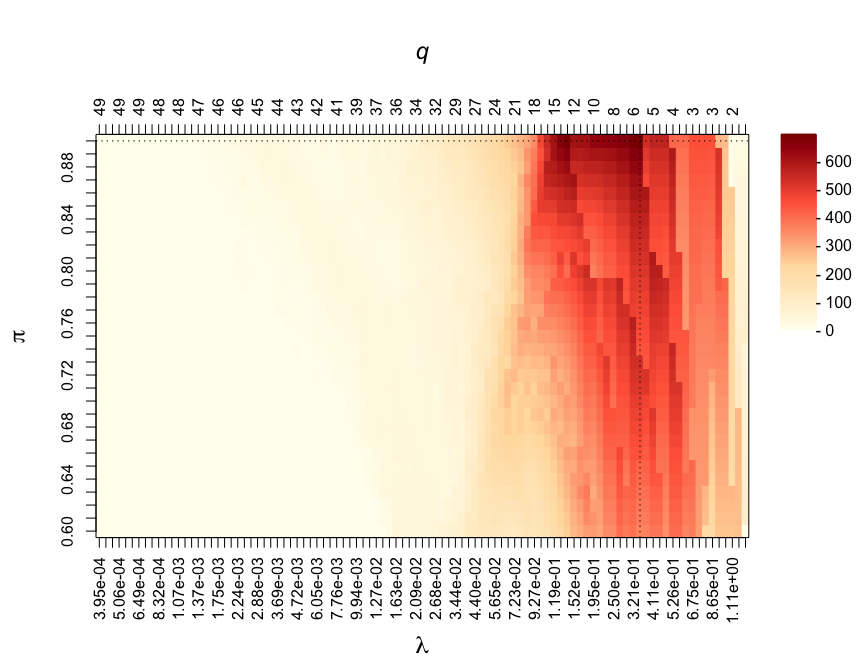
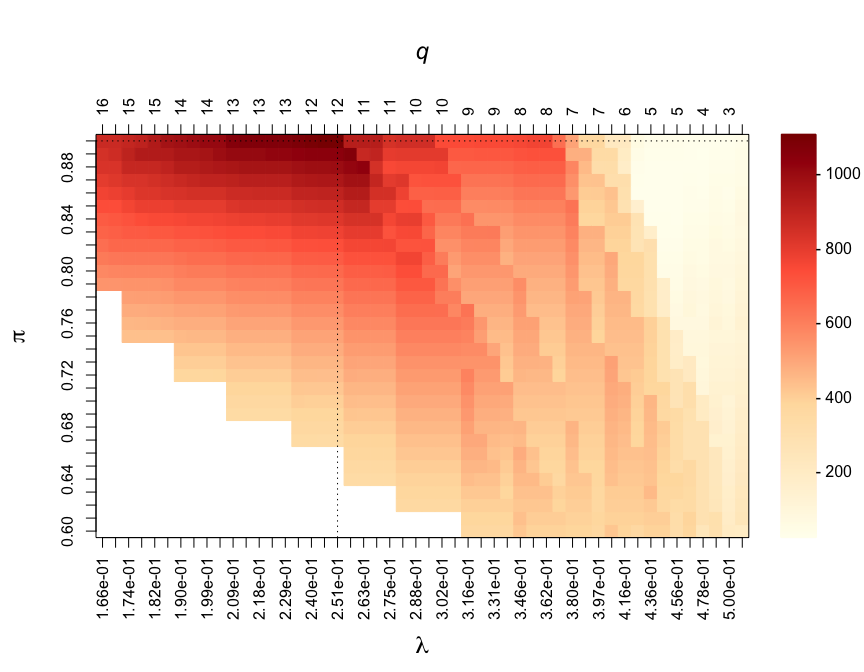
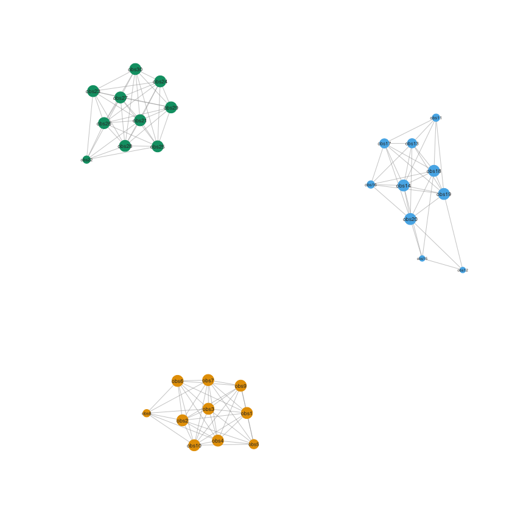

<!-- README.md is generated from README.Rmd. Please edit that file -->

# focus: Feature selectiOn and Clustering Using Stability

<!-- badges: start -->
<!-- badges: end -->

Implementation of stability-enhanced models for variable selection in
regression, graphical modelling and clustering. These methods are based
on resampling approaches to compute selection proportions. Calibration
of the models is done via maximisation of a stability score measuring
how unlikely it is that the selection procedure is uniform.

## Installation

<!-- You can install the released version of focus from [CRAN](https://CRAN.R-project.org) with: -->
<!-- ``` r -->
<!-- install.packages("focus") # devtools::install_github("barbarabodinier/focus") -->
<!-- ``` -->

The development version can be downloaded from
[GitHub](https://github.com/) and installed using the following command
from a working directory containing the folder:

``` r
devtools::install("focus")
```

## Variable selection

### Data simulation

A dataset with n=100 observations for p=50 potential predictors and a
continuous outcome is simulated:

``` r
library(focus)

# Data simulation
set.seed(1)
simul <- SimulateRegression(n = 100, pk = 50)

# Potential predictors
X <- simul$xdata
print(dim(X))
#> [1] 100  50

# Continuous outcome
Y <- simul$ydata
print(dim(Y))
#> [1] 100   1
```

### Stability selection

Stability selection in a regression framework is implemented in the
function `VariableSelection()`. The predictor and outcome datasets are
provided as input:

``` r
stab <- VariableSelection(xdata = X, ydata = Y)
```

Stability selection models are run for multiple pairs of parameters λ
(controlling the sparsity of the underlying algorithm) and π (threshold
in selection proportions). By default, stability selection is run in
applied to LASSO regression, as implemented in `glmnet`. The grids of
parameter values used in the run can be extracted using:

``` r
# First few penalty parameters
print(head(stab$Lambda))
#>         [,1]
#> s0 0.2531010
#> s1 0.2341099
#> s2 0.2165437
#> s3 0.2002956
#> s4 0.1852667
#> s5 0.1713655

# Grid of thresholds in selection proportion
print(stab$params$pi_list)
#>  [1] 0.60 0.61 0.62 0.63 0.64 0.65 0.66 0.67 0.68 0.69 0.70 0.71 0.72 0.73 0.74
#> [16] 0.75 0.76 0.77 0.78 0.79 0.80 0.81 0.82 0.83 0.84 0.85 0.86 0.87 0.88 0.89
#> [31] 0.90

# Number of model pairs (i.e. number of visited stability selection models)
print(nrow(stab$Lambda) * length(stab$params$pi_list))
#> [1] 3100
```

### Calibration

The two parameters are jointly calibrated by maximising the stability
score, measuring how unlikely it is that features are uniformly
selected:

``` r
par(mar = c(7, 5, 7, 6))
CalibrationPlot(stab)
```



Visited penalty parameters λ are represented on the x-axis. The
corresponding average number of selected features by the underlying
algorithm (here, LASSO models) are reported on the z-axis and denoted by
q. The different thresholds in selection proportions π are represented
on the y-axis. The stability score obtained for different pairs of
parameters (λ, π) are colour-coded and ranging from 0 to 1,200 on this
example.

### Outputs

The calibrated set of stably selected variables is obtained from:

``` r
stably_selected <- SelectedVariables(stab)
print(stably_selected)
#>  var1  var2  var3  var4  var5  var6  var7  var8  var9 var10 var11 var12 var13 
#>     0     0     0     0     0     0     0     0     0     0     0     0     0 
#> var14 var15 var16 var17 var18 var19 var20 var21 var22 var23 var24 var25 var26 
#>     0     0     0     0     0     0     1     0     0     0     0     0     0 
#> var27 var28 var29 var30 var31 var32 var33 var34 var35 var36 var37 var38 var39 
#>     0     0     1     0     0     0     0     1     0     0     0     0     0 
#> var40 var41 var42 var43 var44 var45 var46 var47 var48 var49 var50 
#>     0     0     0     0     0     0     0     0     0     1     0
print(table(stably_selected))
#> stably_selected
#>  0  1 
#> 46  4
```

In this example, 11 variables are stably selected.

Additionally, selection proportions of the calibrated model can be
extracted:

``` r
selprop <- SelectionProportions(stab)
print(selprop)
#>  var1  var2  var3  var4  var5  var6  var7  var8  var9 var10 var11 var12 var13 
#>  0.00  0.00  0.00  0.00  0.03  0.00  0.00  0.00  0.00  0.00  0.00  0.03  0.00 
#> var14 var15 var16 var17 var18 var19 var20 var21 var22 var23 var24 var25 var26 
#>  0.00  0.02  0.00  0.00  0.00  0.00  1.00  0.00  0.00  0.01  0.00  0.13  0.62 
#> var27 var28 var29 var30 var31 var32 var33 var34 var35 var36 var37 var38 var39 
#>  0.00  0.00  0.94  0.00  0.00  0.00  0.00  0.96  0.01  0.00  0.01  0.00  0.00 
#> var40 var41 var42 var43 var44 var45 var46 var47 var48 var49 var50 
#>  0.14  0.00  0.14  0.00  0.00  0.00  0.00  0.00  0.00  1.00  0.00
```

Selection proportions can be used to rank the variables by relevance in
association with the outcome:

``` r
selprop_ranked <- sort(selprop, decreasing = TRUE)
plot(selprop_ranked,
  type = "h", lwd = 3, las = 1, cex.lab = 1.3, bty = "n", ylim = c(0, 1),
  col = ifelse(selprop_ranked >= Argmax(stab)[2], yes = "red", no = "grey"),
  xaxt = "n", xlab = "", ylab = "Selection proportions"
)
abline(h = Argmax(stab)[2], lty = 2, col = "darkred")
axis(side = 1, at = 1:length(selprop_ranked), labels = names(selprop_ranked), las = 2)
```


## Graphical modelling

### Data simulation

A dataset with n=100 observations of p=10 nodes with an underlying graph
structure is simulated:

``` r
# Data simulation
set.seed(1)
simul <- SimulateGraphical(n = 100, pk = 10, topology = "scale-free")

# Variables are nodes
X <- simul$data
print(dim(X))
#> [1] 100  10
```

### Stability selection

Stability selection for graphical modelling is implemented in
`GraphicalModel()`. For sparser estimates, the model can be estimated
under the constraint that the upper-bound of the expected number of
falsely selected edges (PFER) is below a user-defined threshold:

``` r
stab <- GraphicalModel(xdata = X, PFER_thr = 10)
```

### Calibration

As for variable selection, the stability selection graphical model is
controlled by two parameters controlling the sparsity of the underlying
algorithm and threshold in selection proportion. These parameters are
jointly calibrated by maximising the stability score:

``` r
par(mar = c(7, 5, 7, 6))
CalibrationPlot(stab)
```


The effect of the constraint on the PFER can be visualised in this
calibration plot. The white area corresponds to “forbidden” models,
where the upper-bound of the expected number of parameters would exceed
the value specified in PFER\_thr.

### Outputs

The adjacency matrix of the calibrated stability selection graphical
model is obtained with:

``` r
myadjacency <- Adjacency(stab)
print(myadjacency)
#>       var1 var2 var3 var4 var5 var6 var7 var8 var9 var10
#> var1     0    0    0    0    0    0    0    0    1     0
#> var2     0    0    0    1    0    0    0    0    0     0
#> var3     0    0    0    0    0    1    0    0    1     1
#> var4     0    1    0    0    1    0    1    1    0     0
#> var5     0    0    0    1    0    0    0    1    0     0
#> var6     0    0    1    0    0    0    0    0    0     1
#> var7     0    0    0    1    0    0    0    0    0     0
#> var8     0    0    0    1    1    0    0    0    0     1
#> var9     1    0    1    0    0    0    0    0    0     0
#> var10    0    0    1    0    0    1    0    1    0     0
```

For visualisation, it can be converted into an igraph object:

``` r
mygraph <- Graph(myadjacency)
set.seed(1)
plot(mygraph)
```



## Clustering

### Data simulation

A dataset with k=3 clusters of participants sharing similar profiles
based on levels of p=50 variables is simulated:

``` r
# Data simulation
set.seed(1)
simul <- SimulateClustering(n = c(3, 5, 4), pk = 50, v_within = c(-1, -0.7))
X <- simul$data

# Visualisation of correlations between participants
par(mar = c(5, 5, 5, 5))
Heatmap(
  mat = cor(t(X)),
  colours = c("navy", "white", "red"),
  legend_range = c(-1, 1)
)
```


### Consensus clustering

Consensus clustering is implemented in `Clustering()`. By default,
hierarchical clustering is used and applied on datasets with subsamples
of the variables. The function takes the data as input:

``` r
stab <- Clustering(xdata = X)
```

### Calibration

As in stability selection, consensus clustering is controlled by a
threshold in proportion and the hyper-parameters of the underlying
algorithm. For consensus clustering applied on hierarchical clustering,
the model is controlled by the threshold π and number of clusters k.
These parameters are jointly calibrated by maximising the stability
score:

``` r
par(mar = c(7, 5, 7, 6))
CalibrationPlot(stab, xlab = "k")
```


### Outputs

The consensus matrix of the calibrated stability selection graphical
model is obtained with:

``` r
mat <- SelectionProportions(stab)
print(mat)
#>       obs1 obs2 obs3 obs4 obs5 obs6 obs7 obs8 obs9 obs10 obs11 obs12
#> obs1  0.00 0.97 0.98 0.02 0.03 0.02 0.02 0.02 0.00  0.00  0.00  0.04
#> obs2  0.97 0.00 0.95 0.03 0.04 0.03 0.03 0.03 0.02  0.02  0.02  0.06
#> obs3  0.98 0.95 0.00 0.00 0.01 0.00 0.00 0.00 0.00  0.00  0.00  0.04
#> obs4  0.02 0.03 0.00 0.00 0.99 1.00 1.00 1.00 0.00  0.03  0.00  0.01
#> obs5  0.03 0.04 0.01 0.99 0.00 0.99 0.99 0.99 0.00  0.03  0.00  0.01
#> obs6  0.02 0.03 0.00 1.00 0.99 0.00 1.00 1.00 0.00  0.03  0.00  0.01
#> obs7  0.02 0.03 0.00 1.00 0.99 1.00 0.00 1.00 0.00  0.03  0.00  0.01
#> obs8  0.02 0.03 0.00 1.00 0.99 1.00 1.00 0.00 0.00  0.03  0.00  0.01
#> obs9  0.00 0.02 0.00 0.00 0.00 0.00 0.00 0.00 0.00  0.97  1.00  0.95
#> obs10 0.00 0.02 0.00 0.03 0.03 0.03 0.03 0.03 0.97  0.00  0.97  0.92
#> obs11 0.00 0.02 0.00 0.00 0.00 0.00 0.00 0.00 1.00  0.97  0.00  0.95
#> obs12 0.04 0.06 0.04 0.01 0.01 0.01 0.01 0.01 0.95  0.92  0.95  0.00
```

In this example, observations that are grouped in the same cluster in
more than 90% (calibrated threshold) of the subsamples are considered as
stable co-members. The stable co-membership status can be obtained from:

``` r
myadjacency <- Adjacency(stab)
print(myadjacency)
#>       obs1 obs2 obs3 obs4 obs5 obs6 obs7 obs8 obs9 obs10 obs11 obs12
#> obs1     0    1    1    0    0    0    0    0    0     0     0     0
#> obs2     1    0    1    0    0    0    0    0    0     0     0     0
#> obs3     1    1    0    0    0    0    0    0    0     0     0     0
#> obs4     0    0    0    0    1    1    1    1    0     0     0     0
#> obs5     0    0    0    1    0    1    1    1    0     0     0     0
#> obs6     0    0    0    1    1    0    1    1    0     0     0     0
#> obs7     0    0    0    1    1    1    0    1    0     0     0     0
#> obs8     0    0    0    1    1    1    1    0    0     0     0     0
#> obs9     0    0    0    0    0    0    0    0    0     1     1     1
#> obs10    0    0    0    0    0    0    0    0    1     0     1     1
#> obs11    0    0    0    0    0    0    0    0    1     1     0     1
#> obs12    0    0    0    0    0    0    0    0    1     1     1     0
```

This matrix can be interpreted like an adjacency matrix and visualised
as a graph:

``` r
mygraph <- Graph(myadjacency)
set.seed(1)
plot(mygraph)
```



The stable clusters are defined as the connected components of this
graph. Stable cluster membership can be obtained using:

``` r
membership <- Clusters(stab)
print(membership)
#>  obs1  obs2  obs3  obs4  obs5  obs6  obs7  obs8  obs9 obs10 obs11 obs12 
#>     1     1     1     2     2     2     2     2     3     3     3     3
```

## Dimensionality reduction

### Data simulation

A dataset with n=100 observations and p=10 variables that could be
reconstructed from a sparse linear combination of orthogonal variables
(Principal Components) is simulated:

``` r
# Data simulation
set.seed(1)
simul <- SimulateComponents(n = 100, pk = c(3, 5, 4), v_within = c(-1, -0.8))
X <- simul$data

# Visualisation of correlations between participants
par(mar = c(5, 5, 5, 5))
Heatmap(
  mat = cor(X),
  colours = c("navy", "white", "red"),
  legend_range = c(-1, 1)
)
```


### Stability selection

Stability selection for dimensionality reduction is implemented in
`BiSelection()`. It can be used in combination with sparse Principal
Component Analysis (sPCA) to recover the sparse set of variables
contributing to the Principal Components (PCs). Stability selection can
be applied on the first three PCs using:

``` r
stab <- BiSelection(xdata = X, implementation = SparsePCA, ncomp = 3)
#> Component 1
#> Loading required namespace: elasticnet
#> Component 2
#> Component 3
```

### Calibration

As for models presented in previous sections, the threshold in selection
proportion and hyper-parameter controlling the sparsity are calibrated
by maximising the stability score. The PC-specific calibrated pair of
parameters are reported in:

``` r
print(stab$summary)
#>   comp nx pix        S
#> 1    1  5 0.9 454.4235
#> 2    2  7 0.9 454.4235
#> 3    3  3 0.9 371.4247
```

### Outputs

The calibrated selection proportions for each of the three PCs can be
obtained from:

``` r
print(stab$selpropX)
#>      var1 var2 var3 var4 var5 var6 var7 var8 var9 var10 var11 var12
#> [1,] 0.00 0.00 0.00 1.00 0.99 1.00 1.00 1.00 0.00  0.01  0.00  0.00
#> [2,] 0.95 0.94 0.95 0.03 0.04 0.02 0.03 0.08 0.99  0.99  0.99  0.99
#> [3,] 0.99 0.99 0.99 0.00 0.00 0.00 0.00 0.00 0.01  0.01  0.01  0.00
```

The sets of stably selected variables for each of the PCs are encoded
in:

``` r
print(stab$selectedX)
#>      var1 var2 var3 var4 var5 var6 var7 var8 var9 var10 var11 var12
#> [1,]    0    0    0    1    1    1    1    1    0     0     0     0
#> [2,]    1    1    1    0    0    0    0    0    1     1     1     1
#> [3,]    1    1    1    0    0    0    0    0    0     0     0     0
```
