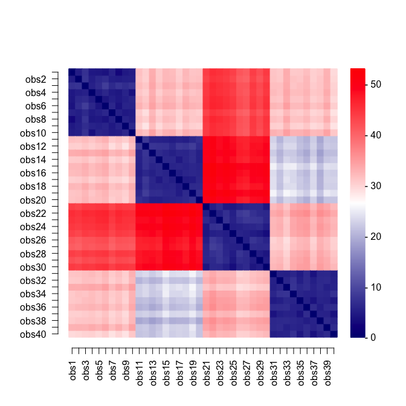
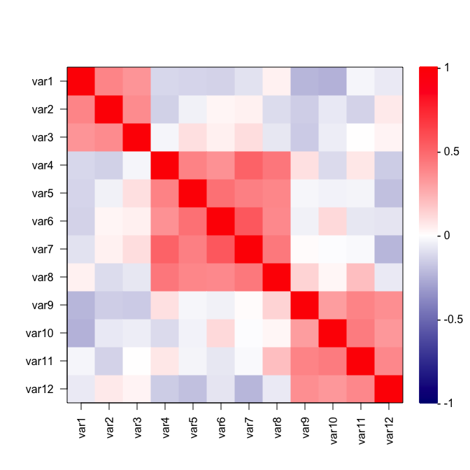

<!-- README.md is generated from README.Rmd. Please edit that file -->

# sharp: Stability-enHanced Approaches using Resampling Procedures

<!-- badges: start -->
<!-- badges: end -->

Implementation of stability selection for graphical modelling and
variable selection in regression and dimensionality reduction. These
models rely on resampling approaches to estimate selection
probabilities. Calibration of the hyper-parameters is done via
maximisation of a stability score measuring the likelihood of
informative (non-uniform) selection procedure. This package also
includes tools to simulate multivariate Normal data with different
(partial) correlation structures.

## Installation

<!-- You can install the released version of sharp from [CRAN](https://CRAN.R-project.org) with: -->
<!-- ``` r -->
<!-- install.packages("sharp") # devtools::install_github("barbarabodinier/sharp") -->
<!-- ``` -->

The development version can be downloaded from
[GitHub](https://github.com/) and installed using the following command
from a working directory containing the folder:

``` r
devtools::install("sharp", upgrade="always")
```

## Variable selection

### Data simulation

A dataset with n=100 observations for p=50 potential predictors and a
continuous outcome is simulated:

``` r
library(sharp)

# Data simulation
set.seed(1)
simul <- SimulateRegression(n = 100, pk = 50)

# Potential predictors
X <- simul$xdata
print(dim(X))
#> [1] 100  50

# Continuous outcome
Y <- simul$ydata
print(dim(Y))
#> [1] 100   1
```

### Stability selection

Stability selection in a regression framework is implemented in the
function `VariableSelection()`. The predictor and outcome datasets are
provided as input:

``` r
stab <- VariableSelection(xdata = X, ydata = Y)
print(stab)
```

Stability selection models are run for multiple pairs of parameters λ
(controlling the sparsity of the underlying algorithm) and π (threshold
in selection proportions). By default, stability selection is run in
applied to LASSO regression, as implemented in `glmnet`. The grids of
parameter values used in the run can be extracted using:

``` r
# First few penalty parameters
print(head(stab$Lambda))
#>        [,1]
#> s0 1.420237
#> s1 1.307513
#> s2 1.203736
#> s3 1.108196
#> s4 1.020239
#> s5 0.939263

# Grid of thresholds in selection proportion
print(stab$params$pi_list)
#>  [1] 0.60 0.61 0.62 0.63 0.64 0.65 0.66 0.67 0.68 0.69 0.70 0.71 0.72 0.73 0.74
#> [16] 0.75 0.76 0.77 0.78 0.79 0.80 0.81 0.82 0.83 0.84 0.85 0.86 0.87 0.88 0.89
#> [31] 0.90

# Number of model pairs (i.e. number of visited stability selection models)
print(nrow(stab$Lambda) * length(stab$params$pi_list))
#> [1] 3100
```

### Calibration

The two parameters are jointly calibrated by maximising the stability
score, measuring how unlikely it is that features are uniformly
selected:

``` r
par(mar = c(7, 5, 7, 6))
CalibrationPlot(stab)
```


``` r
summary(stab)
#> Calibrated parameters: lambda = 0.348 and pi = 0.900
#> 
#> Maximum stability score: 694.140
#> 
#> Number of selected variable(s): 4
```

Visited penalty parameters λ are represented on the x-axis. The
corresponding average number of selected features by the underlying
algorithm (here, LASSO models) are reported on the z-axis and denoted by
q. The different thresholds in selection proportions π are represented
on the y-axis. The stability score obtained for different pairs of
parameters (λ, π) are colour-coded and ranging from 0 to 1,200 on this
example.

### Outputs

Stably selected variables in the calibrated model are denoted by a “1”
in:

``` r
SelectedVariables(stab)
#>  var1  var2  var3  var4  var5  var6  var7  var8  var9 var10 var11 var12 var13 
#>     0     0     0     0     0     0     0     0     0     0     0     0     0 
#> var14 var15 var16 var17 var18 var19 var20 var21 var22 var23 var24 var25 var26 
#>     0     0     0     0     0     0     1     0     0     0     0     0     1 
#> var27 var28 var29 var30 var31 var32 var33 var34 var35 var36 var37 var38 var39 
#>     0     0     0     0     0     0     0     1     0     0     0     0     0 
#> var40 var41 var42 var43 var44 var45 var46 var47 var48 var49 var50 
#>     0     0     1     0     0     0     0     0     0     0     0
```

Selection proportions of the calibrated model can be extracted using:

``` r
SelectionProportions(stab)
#>  var1  var2  var3  var4  var5  var6  var7  var8  var9 var10 var11 var12 var13 
#>  0.00  0.02  0.00  0.00  0.35  0.00  0.00  0.05  0.01  0.01  0.00  0.02  0.00 
#> var14 var15 var16 var17 var18 var19 var20 var21 var22 var23 var24 var25 var26 
#>  0.00  0.00  0.00  0.00  0.00  0.06  1.00  0.00  0.00  0.00  0.00  0.00  1.00 
#> var27 var28 var29 var30 var31 var32 var33 var34 var35 var36 var37 var38 var39 
#>  0.18  0.00  0.51  0.01  0.00  0.00  0.00  0.97  0.00  0.00  0.03  0.01  0.00 
#> var40 var41 var42 var43 var44 var45 var46 var47 var48 var49 var50 
#>  0.00  0.01  0.90  0.01  0.00  0.00  0.01  0.00  0.00  0.73  0.04
```

Selection proportions can be used to rank the variables by relevance in
association with the outcome:

``` r
plot(stab)
```


## Graphical modelling

### Data simulation

A dataset with n=100 observations of p=10 nodes with an underlying graph
structure is simulated:

``` r
# Data simulation
set.seed(1)
simul <- SimulateGraphical(n = 100, pk = 10, topology = "scale-free")

# Variables are nodes
X <- simul$data
print(dim(X))
#> [1] 100  10
```

### Stability selection

Stability selection for graphical modelling is implemented in
`GraphicalModel()`. For sparser estimates, the model can be estimated
under the constraint that the upper-bound of the expected number of
falsely selected edges (PFER) is below a user-defined threshold:

``` r
stab <- GraphicalModel(xdata = X, PFER_thr = 10)
print(stab)
```

### Calibration

As for variable selection, the stability selection graphical model is
controlled by two parameters controlling the sparsity of the underlying
algorithm and threshold in selection proportion. These parameters are
jointly calibrated by maximising the stability score:

``` r
par(mar = c(7, 5, 7, 6))
CalibrationPlot(stab)
```


``` r
summary(stab)
#> Calibrated parameters: lambda = 0.251 and pi = 0.900
#> 
#> Maximum stability score: 1102.130
#> 
#> Number of selected edge(s): 9
```

The effect of the constraint on the PFER can be visualised in this
calibration plot. The white area corresponds to “forbidden” models,
where the upper-bound of the expected number of parameters would exceed
the value specified in PFER\_thr.

### Outputs

The calibrated graph can be visualised using:

``` r
set.seed(1)
plot(stab)
```


The adjacency matrix of the calibrated stability selection graphical
model can also be extracted using:

``` r
Adjacency(stab)
#>       var1 var2 var3 var4 var5 var6 var7 var8 var9 var10
#> var1     0    0    0    0    0    0    0    0    1     0
#> var2     0    0    0    1    0    0    0    0    0     0
#> var3     0    0    0    0    0    0    0    0    1     1
#> var4     0    1    0    0    1    0    1    1    0     0
#> var5     0    0    0    1    0    0    0    0    0     0
#> var6     0    0    0    0    0    0    0    0    0     1
#> var7     0    0    0    1    0    0    0    0    0     0
#> var8     0    0    0    1    0    0    0    0    0     1
#> var9     1    0    1    0    0    0    0    0    0     0
#> var10    0    0    1    0    0    1    0    1    0     0
```

And converted to an igraph object using:

``` r
mygraph=Graph(Adjacency(stab))
mygraph
#> IGRAPH 8cecd29 UN-- 10 9 -- 
#> + attr: name (v/c), size (v/n), label (v/c), color (v/c), shape (v/c),
#> | frame.color (v/c), label.family (v/c), label.cex (v/n), label.color
#> | (v/c), color (e/c), width (e/n)
#> + edges from 8cecd29 (vertex names):
#> [1] var1--var9  var2--var4  var3--var9  var3--var10 var4--var5  var4--var7 
#> [7] var4--var8  var6--var10 var8--var10
set.seed(1)
plot(mygraph)
```



## Dimensionality reduction

### Data simulation

A dataset with n=100 observations and p=10 variables that could be
reconstructed from a sparse linear combination of orthogonal variables
(Principal Components) is simulated:

``` r
# Data simulation
set.seed(1)
simul <- SimulateComponents(n = 100, pk = c(3, 5, 4), v_within = c(0.8, 1), v_sign = -1)
#> The smallest proportion of explained variance by PC1 that can be obtained is 0.24.
X <- simul$data

# Visualisation of correlations between participants
par(mar = c(5, 5, 5, 5))
Heatmap(
  mat = cor(X),
  colours = c("navy", "white", "red"),
  legend_range = c(-1, 1)
)
```



### Stability selection

Stability selection for dimensionality reduction is implemented in
`BiSelection()`. It can be used in combination with sparse Principal
Component Analysis (sPCA) to recover the sparse set of variables
contributing to the Principal Components (PCs). Stability selection can
be applied on the first three PCs using:

``` r
stab <- BiSelection(xdata = X, implementation = SparsePCA, ncomp = 3)
#> Component 1
#> Loading required namespace: elasticnet
#> Component 2
#> Component 3
```

### Calibration

As for models presented in previous sections, the threshold in selection
proportion and hyper-parameter controlling the sparsity are calibrated
by maximising the stability score. The PC-specific calibrated pair of
parameters are reported in:

``` r
stab$summary
#>   comp nx  pix        S
#> 1    1  5 0.90 454.4235
#> 2    2  6 0.88 242.0888
#> 3    3  3 0.84 272.4526
```

### Outputs

The sets of stably selected variables for each of the PCs are encoded
in:

``` r
SelectedVariables(stab)
#>       comp1 comp2 comp3
#> var1      0     0     1
#> var2      0     0     1
#> var3      0     0     1
#> var4      1     0     0
#> var5      1     0     0
#> var6      1     0     0
#> var7      1     0     0
#> var8      1     0     0
#> var9      0     1     0
#> var10     0     1     0
#> var11     0     1     0
#> var12     0     0     0
```

The calibrated selection proportions for each of the three PCs can be
obtained from:

``` r
SelectionProportions(stab)
#>       comp1 comp2 comp3
#> var1   0.08  0.76  0.84
#> var2   0.05  0.68  0.86
#> var3   0.00  0.42  0.87
#> var4   0.91  0.09  0.01
#> var5   0.91  0.09  0.00
#> var6   0.92  0.10  0.01
#> var7   0.91  0.11  0.00
#> var8   0.93  0.21  0.00
#> var9   0.08  0.91  0.07
#> var10  0.08  0.88  0.06
#> var11  0.07  0.90  0.13
#> var12  0.06  0.85  0.15
```
